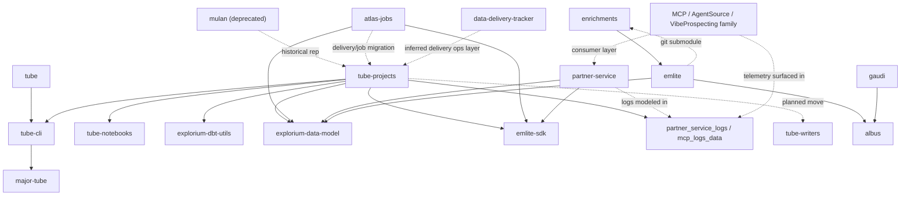
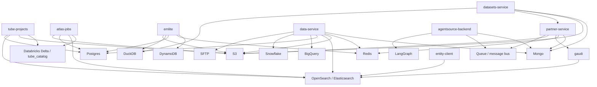

# Atlas Repo Map

## Use
- Read this file for Atlas architecture, repo lineage, and cross-repo integration questions.
- Prefer **confirmed** edges over **inferred** ones.
- Re-check repo-local code when a question depends on current implementation details.

## Confidence
- **confirmed** — explicit dependency, import, submodule, CI path, migration note, or repo description
- **inferred** — strong structural signal, but no direct code/docs edge in the current scan
- **unresolved** — repo is Atlas-adjacent, but the technical edge is not yet proven

## System Map

## Datastore / Persistence Map

Use this section for questions about which repo touches which storage system, table, index, queue, or object store.
Treat exact object names as implementation details: re-check repo-local code before making changes.

| repo | component / area | datastore | objects / indexes / tables | mode | confidence |
|---|---|---|---|---|---|
| `tube-projects` | `partner_service_logs` | Databricks Delta | `projects__partner_service_logs__prod.*`, especially `mcp_logs_data` | write/read | confirmed |
| `tube-projects` | `partner_service_logs` bronze | S3 -> Databricks Delta | `agent-source-notification` S3 prefix -> `tube_bronze_dev.partner_service_agent_source_notification` | source/read | confirmed |
| `tube-projects` | `business_catalog` | Databricks Delta | `projects__business_catalog__prod.mart_business_catalog_eac` | write/output | confirmed |
| `tube-projects` | `business_catalog` | Databricks Delta | `eds__entities__prod.*`, `contacts_united__contacts_united_base__prod.contacts_united_base_v2`, `projects__prospecting_app__prod.int_em_product_and_services` | read | confirmed |
| `tube-projects` | operations notebooks | OpenSearch / Postgres | generated indexes/aliases and utility connectors | write/read | confirmed; object extraction needed |
| `atlas-jobs` | privacy jobs | OpenSearch | `contacts_starter` | delete/update | confirmed |
| `atlas-jobs` | privacy jobs | Postgres | gold/prod contact tables resolved from views | delete | confirmed |
| `atlas-jobs` | privacy jobs | Databricks Delta | `projects__privacy__prod.records_to_send_*`, `projects__privacy__prod.blacklist`, contact/source tables | read/write/delete candidates | confirmed |
| `atlas-jobs` | delivery jobs | Databricks Delta / S3 | customer delivery tables and buckets | read/write | confirmed; per-job extraction needed |
| `emlite` | metadata | Git/S3 | `enrichments` synced to `emlite.prod/metadata/latest` | source/read | confirmed |
| `emlite` | enrichers | Postgres | resource-defined `PostgresAction.table` | read | confirmed |
| `emlite` | cache | DynamoDB | `emlite_cache_v2_serp_ml_step`, `emlite_cache_v2_new_bright_serp_ml_step`, `emlite_cache_read_url_text` | read/write cache | confirmed |
| `emlite` | request tracking | Redis | request status / queue keys | read/write | confirmed |
| `emlite` | pipeline execution | DuckDB | in-memory `steps.*` tables | transient read/write | confirmed |
| `gaudi` | query metadata | OpenSearch / Elasticsearch | `business_catalog`, `contacts_starter`, `outreach_poc` | query / KNN query | confirmed |
| `gaudi` | query metadata lookups | OpenSearch / Elasticsearch | `bc_labels_google_related_categories`, `bc_labels_naics_related_categories`, `bc_labels_linkedin_related_categories`, `bc_labels_products_and_services` | lookup query | confirmed |
| `partner-service` | app persistence | Mongo | app DB named `mongo` | read/write | confirmed |
| `partner-service` | business search | Gaudi -> OpenSearch | `business_catalog` via `business_catalog_partners` | query | confirmed |
| `partner-service` | prospect search | Gaudi -> OpenSearch | `contacts_starter` via `pdl_us_professional_information_v2_partners` | query | confirmed |
| `partner-service` | identify | Gaudi -> OpenSearch | `outreach_poc` via `padel_prod` | query / KNN query | confirmed |
| `partner-service` | enrichment | EMLite | `emlite-sdk` | API call | confirmed |
| `partner-service` | entity lookup | `entity-client` | entity-client service URL | API call | confirmed |
| `partner-service` | audit/events | S3 / queue | events audit buckets; `agent-source-auditor-input-prod` queue | write | confirmed name; queue tech unresolved |
| `partner-service` | rate limiting | Redis | `rate_limit:*` keys | read/write when enabled | confirmed in tests/config; prod enablement unclear |
| `data-service` | app persistence | Mongo | Albus app persistence | read/write | confirmed |
| `data-service` | background jobs | Redis/RQ | RQ queues | read/write | confirmed |
| `data-service` | identify dedup | S3 | `explorium.data.platform-prod-us` | read/write | confirmed |
| `data-service` | connectors | S3 / Postgres / MySQL / BigQuery / Snowflake / SFTP | provider-configured buckets, files, and tables | read/write | confirmed |
| `data-service` | search / identify | Gaudi -> OpenSearch | `outreach_poc`, `contacts_starter` depending on flow | query | confirmed via config/deps |
| `data-service` | enrichment | EMLite | `emlite-sdk` | API call | confirmed |
| `datasets-service` | app persistence | Mongo | app DB named `mongo` | read/write | confirmed |
| `datasets-service` | dataset files | S3 | `mcp-datasets-prod`, `mcp-datasets-dev` | read/write | confirmed |
| `datasets-service` | matching | Partner API | `api.explorium.ai` / partner-service | API call | confirmed |
| `datasets-service` | local processing | DuckDB | transient dedup/query tables | transient read/write | confirmed |
| `entity-client` | matching/search | OpenSearch | endpoint from `eds.endpoint`; alias `edm6_entities_organization_eds2_full` | query | confirmed |
| `entity-client` | matching/search | OpenSearch | selected table names such as `linkedin-crunchbase`, `pdl_expanded_company_domain`, `dnb_hoovers` | query filters | confirmed |
| `agentsource-backend` | app persistence | Mongo | Albus mongo extra | read/write | confirmed dependency; objects unresolved |
| `agentsource-backend` | messaging | Albus message bus | queues/topics unresolved | read/write | confirmed dependency; objects unresolved |
| `agentsource-backend` | AI execution | LangGraph | prod LangGraph URL | API call | confirmed |

## Core Atlas Repos

| repo | role | team / domain signal | confirmed relations | confidence |
|---|---|---|---|---|
| `atlas-jobs` | Legacy / still-active Atlas Databricks jobs and notebooks | README says Atlas team | Uses `emlite-sdk`; registers `explorium-data-model` UDFs; some delivery jobs already migrated to `tube-projects` | confirmed |
| `tube-projects` | Main ETL/dbt monorepo for Atlas and adjacent teams | Shared ETL monorepo; several EDS models marked `Team: Atlas` | Depends on `tube-cli`; CI runs workspace notebook from `tube-notebooks`; many dbt projects import `explorium-dbt-utils`; orchestration registers UDFs from `explorium-data-model`; notebooks call `emlite-sdk`; absorbs migrations from `mulan` and `atlas-jobs` | confirmed |
| `mulan` | Deprecated historical EDS repo | Historical repo for the same Atlas / DPD team | Superseded by `tube-projects`; keep only for lineage and old references | confirmed |
| `enrichments` | Source of truth for enrichment/resource metadata | Enrichment config domain | CI syncs repo contents to `emlite.prod/metadata/latest`; dev tooling depends on `emlite-cli`; feeds `emlite` configs | confirmed |
| `emlite` | Enrichment runtime / microservice | CODEOWNERS points to infra | Depends on `albus`; depends on `explorium-data-model`; ships `emlite-sdk` and `emlite-cli`; embeds `enrichments` as git submodule | confirmed |
| `explorium-data-model` | Shared ontology/entity wrapper SDK | Shared data-model domain | Wraps `edm-transformation` and `edm-catalog`; fronts `edm-ontology-catalog`; used directly by `emlite`, `atlas-jobs`, and `tube-projects` UDF registration | confirmed |
| `gaudi` | Query rendering engine | Query / search layer | Depends on `albus`; no direct edge from the current Atlas ETL/enrichment scan | unresolved |
| `Atlas` | Data solutions team repo | Repo description says Data solutions team | Atlas-adjacent by org metadata; no explicit technical edge found in the current scan | unresolved |

## Adjacent Platform Repos

| repo | role | relation to Atlas stack | confidence |
|---|---|---|---|
| `tube` | Local onboarding / pipeline dev environment | `tube-projects` README points users to `tube`; `tube` README says all user actions are done with `tube-cli` | confirmed |
| `tube-cli` | CLI for Tube workflows | Direct dependency in `tube-projects` and `mulan`; `tube` centers on it | confirmed |
| `major-tube` | Tube backend/control plane | `tube-cli` setup points to `major-tube` backend URLs | confirmed |
| `tube-notebooks` | Shared Databricks notebook repo | `tube-projects` and `mulan` CI use workspace path under `tube-notebooks` | confirmed |
| `explorium-dbt-utils` | Shared dbt macros/package | Imported by `tube-projects` and `mulan` EDS dbt packages | confirmed |
| `tube-writers` | Writer / notebook utility repo | `tube-projects` orchestration notebook has TODOs to move UDF registration code into `tube-writers` | confirmed |
| `albus` | Platform commons library | Direct dependency of `emlite` and `gaudi` | confirmed |
| `data-delivery-tracker` | Delivery control center | Has Slack + Databricks integration; fits as ops layer around Atlas delivery outputs, but no direct repo-to-repo import was found | inferred |

## Company-Facing Consumer Layer

| repo / family | role | relation to Atlas stack | confidence |
|---|---|---|---|
| `partner-service` | Main service entry point for partner operations | Repo README says it is the main entry point for partner operations; org-wide code-search results showed references to `emlite-sdk` and `explorium-data-model`; `tube-projects` contains `partner_service_logs` ETL for partner-service-related logs | confirmed |
| `mcp-explorium` | Hosted Explorium MCP entrypoint | README exposes the company business-data MCP server; sits as an external access layer over Explorium business/prospect data, but the direct backend repo edges were not proven in this scan | inferred |
| `mcp-explorium-ts` | TypeScript MCP server for Explorium API | README says it interacts with the Explorium API for businesses and prospects; consumer/API layer above Atlas-owned data products, but direct backend repo edges were not proven in this scan | inferred |
| `mcp-*` infra repos (`mcp-playground-*`, `mcp-auth0-oidc`, `mcp-registry`, `mcp-tail-worker`, `mcp-scale*`) | MCP product / infra support layer | Repo names and descriptions place them around the MCP product surface; `tube-projects` has `mcp_logs_data`, which confirms MCP traffic is modeled in Atlas ETL, but not which specific infra repo feeds it | inferred |
| `agentsource-*`, `vibeprospecting-*`, `prospecting`, `explorium-api-skill` | GTM / partner / AI-consumer layer | Repo descriptions show partner, prospecting, or AI-plugin surfaces; treat these as downstream consumers of business/contact data unless a direct code edge is proven | inferred |

## Internal Component Graphs

### `emlite` stack
- `enrichments` -> metadata/config source for `emlite`
- `emlite` -> runtime service
- `emlite-sdk` / `emlite-cli` -> packaged interfaces exposed from `emlite`
- `atlas-jobs`, `tube-projects`, and `mulan` call `emlite-sdk` from notebooks/jobs

### `explorium-data-model` stack
- `explorium-data-model` -> wrapper SDK
- `explorium-data-model` -> `edm-transformation`
- `explorium-data-model` -> `edm-catalog`
- `edm-transformation` -> `edm-ontology-catalog`
- `edm-catalog` -> `edm-typing`
- Atlas consumers use the wrapper repo, not the inner repos directly, unless doing lower-level EDM work

### Tube / Databricks stack
- `tube` -> local developer environment
- `tube-cli` -> CLI used by Tube repos
- `tube-notebooks` -> shared workspace notebooks used by CI / orchestration
- `tube-projects` / `mulan` -> dbt + notebook repos running on that stack
- `explorium-dbt-utils` -> shared dbt package across Atlas/EDS dbt projects

## Cross-Team Integration Story

### DPD == Atlas
- Treat `DPD` and `Atlas` as the same team for this skill.
- `mulan` is historical naming / repo lineage, not a separate team boundary.
- The current source of truth is `tube-projects`; use `mulan` only for archaeology.

### Atlas <-> Enrichment Infra
- Atlas jobs and notebooks do not own enrichment execution logic directly.
- Instead, they call `emlite-sdk`, which delegates execution to `emlite`.
- `enrichments` remains the config/source-of-truth repo for enrichment definitions.

### Atlas <-> Shared Data Model
- Atlas flows depend on `explorium-data-model` for ontology/type/transformer behavior.
- `tube-projects` and `atlas-jobs` explicitly register EDM transformers as Databricks UDFs.
- `emlite` also depends on the same data model, so enrichment semantics and Atlas ETL semantics meet at EDM.

### Atlas <-> Tube Platform
- Atlas ETL repos sit on the Tube toolchain rather than inventing their own execution substrate.
- The strongest shared platform pieces are `tube-cli`, `tube-notebooks`, and `explorium-dbt-utils`.

### Atlas <-> Partner / MCP Surface
- `partner-service` is part of the company-facing service layer, not the ETL layer, but it is not disconnected from Atlas.
- `tube-projects` contains a dedicated `partner_service_logs` pipeline and marts such as `mcp_logs_data`, proving partner/MCP traffic is represented inside Atlas ETL.
- Current evidence is strongest on telemetry / audit / usage modeling, not on exact per-repo runtime ownership for every MCP repo.

### Atlas <-> Delivery Operations
- Delivery logic historically lived in `atlas-jobs` for some jobs.
- Confirmed migrations moved delivery work into `tube-projects` for at least `i360` and `commonroom` flows.
- `data-delivery-tracker` looks like the ops/control-plane layer for delivery visibility, but that edge is still inferred.

## Org-Wide Dependency Signals From Full GitHub Scan

These came from org-wide GitHub metadata + code search and are useful for scoping blast radius.

### Repos referencing `emlite-sdk`
`atlas-jobs`, `tube-projects`, `mulan`, `data-service`, `datasets-service`, `enrichment_catalog`, `partner-service`, `SEO-pages-generation`, `emlite`

### Repos referencing `tube-cli`
`Atlas`, `google-maps-collector`, `major-tube`, `mulan`, `ok-team-dbt-projects`, `tube`, `tube-alex`, `tube-cli`, `tube-cli-e2e`, `tube-custom-transformers`, `tube-projects`, `tube-silver-projects`, `tube-vsc`, `workforce_trend_new`

### Repos referencing `explorium-data-model` (selected notable repos)
`albus`, `atlas-jobs`, `data-service`, `datasets-service`, `eds-writer`, `emlite`, `enrichment-manager`, `entity-client`, `explorium-data-model`, `hydro-udf`, `ontology-sdk`, `partner-service`, `plato`, `project-displayer`, `tube-custom-transformers`, `tube-notebooks`, `tube-projects`, `tube-udf-catalog`

### Repos referencing `explorium-dbt-utils`
`tube-projects`, `mulan`, `explorium-dbt-utils`

## Known Gaps
- `gaudi` is in the Atlas local repo set, but this scan did not prove a direct edge from the Atlas ETL/enrichment stack.
- `Atlas` is clearly atlas-adjacent by naming/description, but its technical integration points were not explicit in the scanned code/docs.
- `data-delivery-tracker` looks operationally relevant, but the current edge to Atlas repos is architectural, not an import/package dependency.
- The MCP / AgentSource / VibeProspecting family is now placed in the consumer layer, but most repo-to-repo edges are still inferred from product descriptions and Atlas telemetry modeling rather than direct imports.
- Later GitHub search expansions hit rate limits, so non-core org-wide lists should be treated as strong samples, not a mathematically complete inventory.

## Quick Answering Rules
- For ETL / dbt / Databricks lineage questions, start with `tube-projects`; use `mulan` only for history.
- For enrichment execution questions, start with `enrichments` -> `emlite` -> `emlite-sdk` consumers.
- For ontology / type / transformer questions, start with `explorium-data-model`.
- For legacy Atlas jobs, check `atlas-jobs`, then verify whether the flow already migrated to `tube-projects`.
- For partner / MCP questions, start with `partner-service` plus `tube-projects/projects/partner_service_logs`.
- Do not claim a direct `gaudi` or `Atlas` integration without fresh repo evidence.
